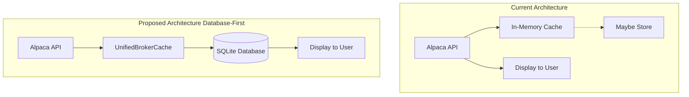
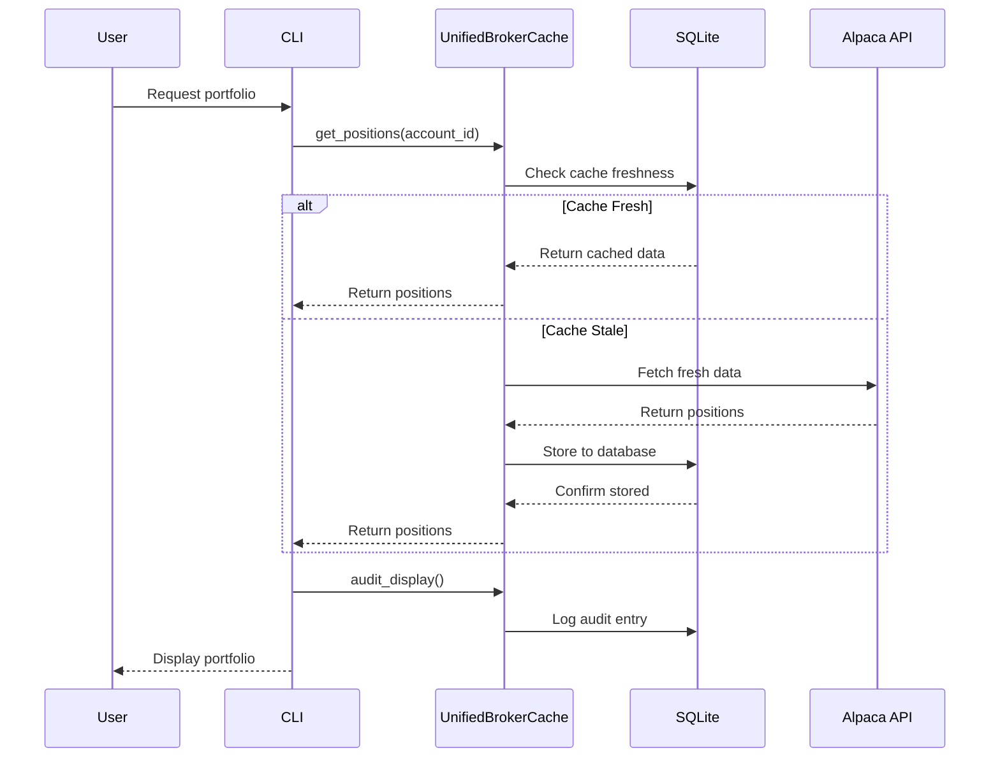
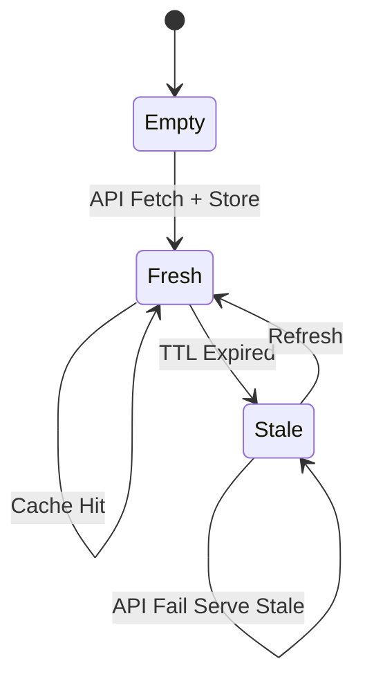
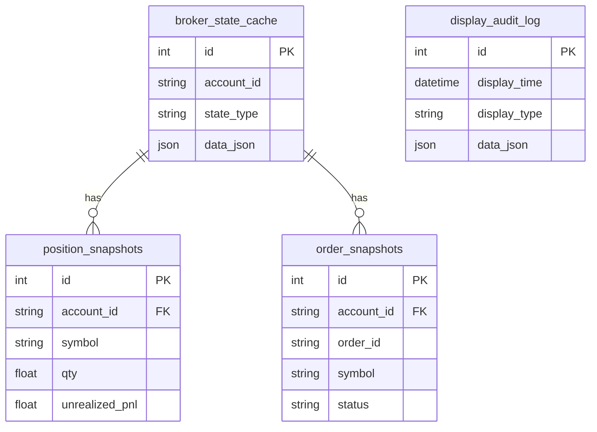
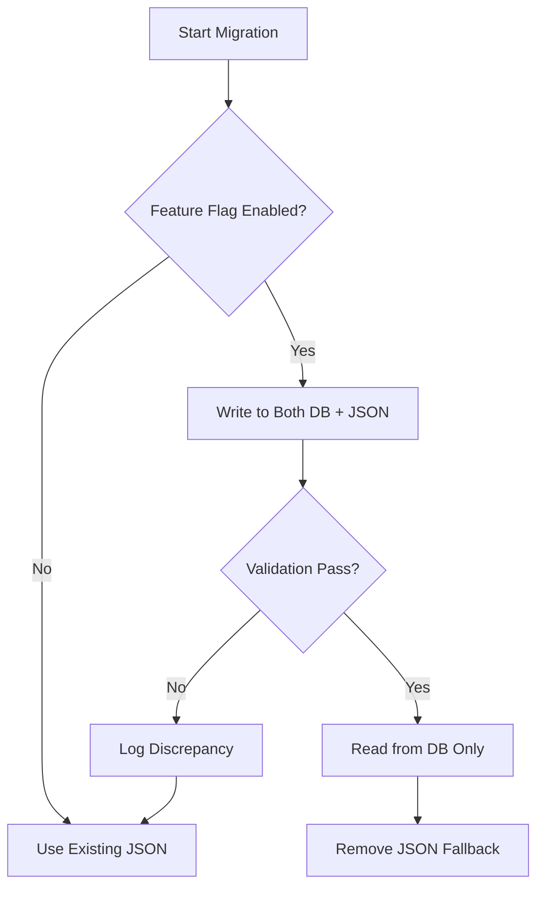

# Database-First Caching Architecture Design

**Issue:** #469
**Status:** Design Phase
**Author:** Claude Code
**Date:** 2025-12-04

## Executive Summary

This document outlines the design for implementing a database-first caching architecture where all data flows through the database before being displayed to users, ensuring consistency between stored and displayed data.

## Current State Analysis

### Data Flow Patterns Identified

| Path | Data Type | Current Pattern | Cache Type | Issues |
|------|-----------|-----------------|------------|--------|
| Market Data | OHLCV bars | fetch -> cache -> display | SQLite | Cache key mismatch (fixed) |
| Account Status | Equity, buying power | fetch -> memory cache -> display | In-memory 60s | No persistence |
| Positions | Holdings, P&L | fetch -> memory cache -> display | In-memory 60s | No audit trail |
| Orders | Open/filled orders | fetch -> display (merge local) | None + JSON | Dual source of truth |
| Analysis | MACD/RSI signals | calculate -> database -> display | SQLite | **Only DB-first path** |

### Current vs Proposed Architecture



### Detailed Data Flow Sequence



### Cache State Machine



### Database Schema - Entity Relationship



## SQL Schema Definitions

### broker_state_cache Table

```sql
CREATE TABLE IF NOT EXISTS broker_state_cache (
    id INTEGER PRIMARY KEY AUTOINCREMENT,
    account_id TEXT NOT NULL,
    state_type TEXT NOT NULL,
    data_json TEXT NOT NULL,
    fetched_at TEXT NOT NULL,
    expires_at TEXT NOT NULL,
    UNIQUE(account_id, state_type)
);
```

## Implementation Plan

### Phase 1: Core Infrastructure (This PR)

1. Create UnifiedBrokerCache class - SQLite-backed broker state caching
2. Fix cache_adapter.py - Fixed cache key mismatch between GET and SET
3. Create BrokerSnapshotManager - Store position/order snapshots

### Phase 2: Integration

1. Replace BrokerStateCache usage with UnifiedBrokerCache
2. Update portfolio_tools.py to query from cache
3. Update order_tools.py to use unified orders table

### Migration Strategy



## Success Metrics

- Cache hit rate greater than 80 percent for broker state
- Display latency less than 500ms
- 100 percent audit coverage for displayed data
- Zero discrepancy between displayed and stored data

## Timeline Estimate

- Phase 1 (Core): 2-3 hours
- Phase 2 (Integration): 3-4 hours
- Phase 3 (Display): 2-3 hours
- Phase 4 (Validation): 1-2 hours

Total: approximately 10 hours of implementation work
